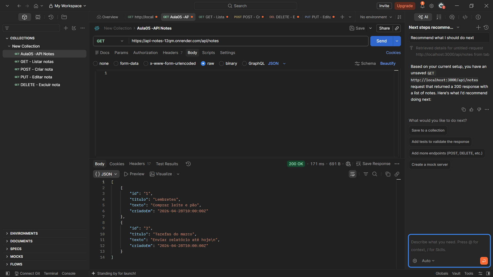
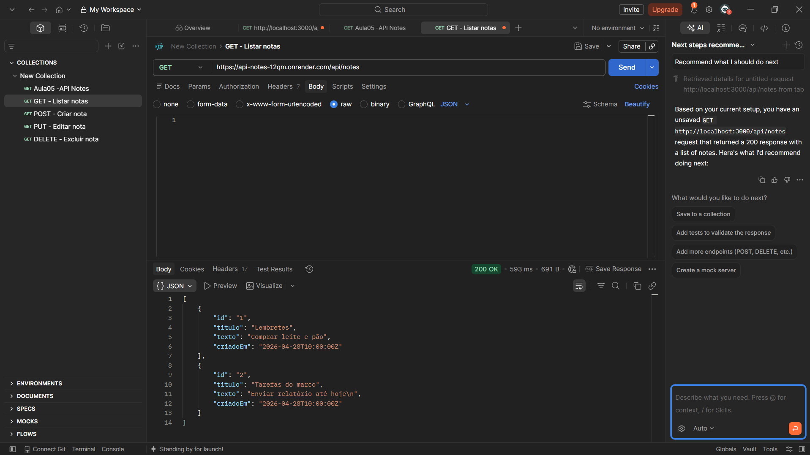
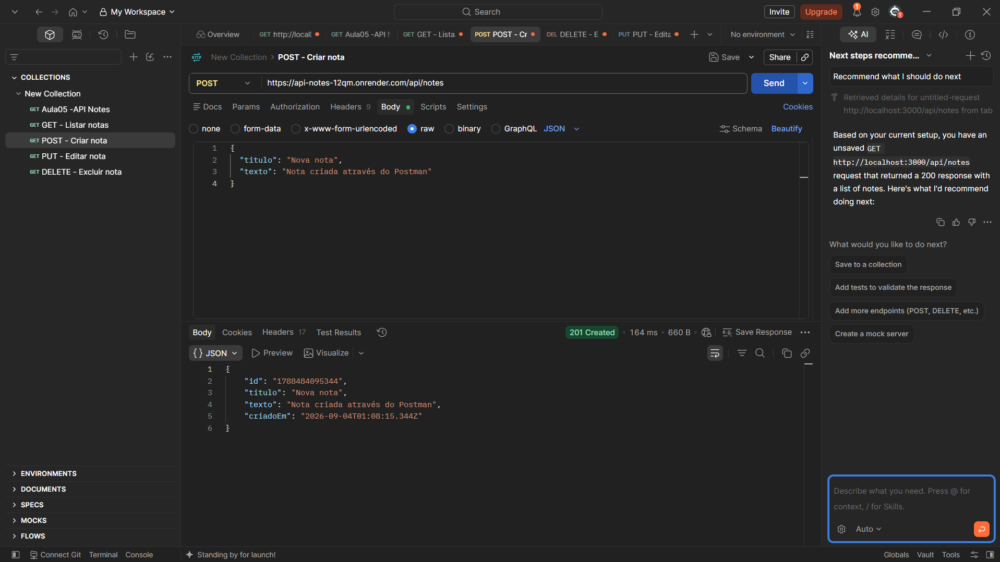
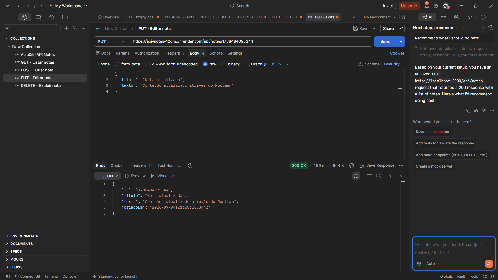
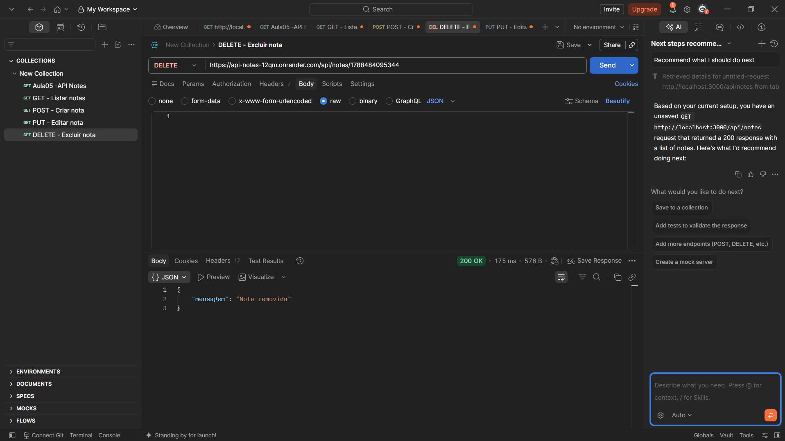

# Documentação — Aula 05

## API REST de Notas + Front-end React

### 1. Introdução

A Aula 05 teve como objetivo desenvolver uma aplicação de notas utilizando uma API REST e um front-end em React. O projeto foi dividido em um backend responsável pelo gerenciamento dos dados e um frontend responsável pela interface e interação com o usuário.

A API foi desenvolvida com Node.js e Express.js, utilizando um arquivo `data.json` para armazenamento das notas. O frontend foi desenvolvido com React e TypeScript (TSX), consumindo a API por meio de requisições HTTP.

---

## 2. Atividade 01 — Formulário

Na primeira atividade foi desenvolvido e enviado um formulário conforme a proposta apresentada em aula.

O objetivo foi praticar a criação e o envio de dados por meio de uma aplicação Web.

---

# 3. Atividade 02 — API de Notas

Nesta etapa foi desenvolvida uma API REST para gerenciamento de notas.

A API possui operações de:

- **GET** — listar notas;
- **POST** — criar uma nova nota;
- **PUT** — editar uma nota existente;
- **DELETE** — excluir uma nota.

### Tecnologias utilizadas

- Node.js
- Express.js
- JavaScript
- JSON
- Postman
- Git e GitHub
- Render
- React
- TypeScript

---

# 4. Backend

O backend foi desenvolvido utilizando Node.js e Express.js.

Os dados das notas são armazenados no arquivo `data.json`.

Cada nota possui informações como:

- `id`
- `titulo`
- `texto`
- `criadoEm`

### Repositório do Backend

https://github.com/mocotoTonin/api-notas

### API publicada no Render

https://api-notes-12qm.onrender.com/api/notes

---

# 5. Testes da API no Postman

Foi criada uma coleção no Postman chamada **Aula05 - API Notes**, contendo as operações necessárias para testar o CRUD da API.

## 5.1 Coleção da API

A coleção contém as seguintes requisições:

- GET — Listar notas
- POST — Criar nota
- PUT — Editar nota
- DELETE — Excluir nota



---

## 5.2 GET — Listar notas

**Método:** `GET`

**Endpoint:**

`https://api-notes-12qm.onrender.com/api/notes`

A requisição retorna as notas cadastradas na API.

**Resultado:** `200 OK`



---

## 5.3 POST — Criar nota

**Método:** `POST`

**Endpoint:**

`https://api-notes-12qm.onrender.com/api/notes`

Foi utilizado um corpo JSON para criar uma nova nota:

```json
{
  "titulo": "Nova nota",
  "texto": "Nota criada através do Postman"
}
```

**Resultado:** `201 Created`



---

## 5.4 PUT — Editar nota

**Método:** `PUT`

**Endpoint:**

`https://api-notes-12qm.onrender.com/api/notes/{id}`

A requisição foi utilizada para atualizar uma nota existente.

Exemplo de corpo enviado:

```json
{
  "titulo": "Nota atualizada",
  "texto": "Conteúdo atualizado através do Postman"
}
```

**Resultado:** `200 OK`



---

## 5.5 DELETE — Excluir nota

**Método:** `DELETE`

**Endpoint:**

`https://api-notes-12qm.onrender.com/api/notes/{id}`

A requisição remove uma nota existente utilizando seu ID.

**Resultado:** `200 OK`

Resposta apresentada:

```json
{
  "mensagem": "Nota removida"
}
```



---

# 6. Front-end

Após o desenvolvimento da API, foi criado um frontend utilizando **React + TypeScript (TSX)**.

A aplicação permite:

- visualizar notas;
- criar novas notas;
- editar notas;
- excluir notas;
- consumir a API publicada no Render.

### Repositório do Front-end

https://github.com/mocotoTonin/frontend-notes

### Deploy na Vercel

https://frontend-notes-eosin.vercel.app/

---

# 7. Integração entre Front-end e Back-end

O frontend foi configurado para consumir a API pública hospedada no Render.

O fluxo da aplicação é:

```text
React + TypeScript
        |
        | Requisições HTTP
        v
API REST - Express.js
        |
        v
     data.json
```

Dessa forma, as ações realizadas na interface do frontend são enviadas para a API, que realiza as operações de criação, consulta, atualização e exclusão das notas.

---

# 8. Deploy

## Backend — Render

A API foi publicada no Render:

https://api-notes-12qm.onrender.com/api/notes

## Frontend — Vercel

A aplicação React foi publicada na Vercel:

https://frontend-notes-eosin.vercel.app/

---

# 9. Repositórios

### Backend

https://github.com/mocotoTonin/api-notas

### Frontend

https://github.com/mocotoTonin/frontend-notes

---

# 10. Conclusão

A atividade possibilitou a aplicação prática dos conceitos de APIs REST, operações CRUD, requisições HTTP, testes com Postman e integração entre frontend e backend.

O projeto também foi publicado utilizando Render para o backend e Vercel para o frontend, permitindo que a aplicação fosse acessada de forma online.
